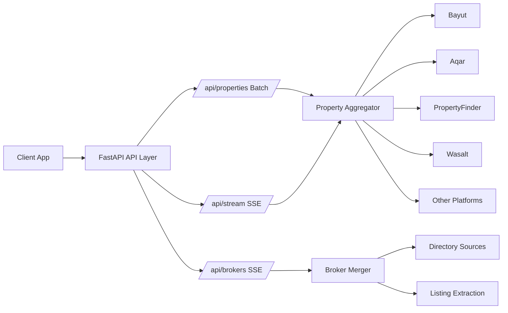

<div align="center">

# Saudi Property Scraper API

### Fastest Multi-Source Saudi Real Estate Scraper for Properties + Brokers

<p align="center">
  
</p>

[](https://www.python.org)
[](https://fastapi.tiangolo.com)
[](https://www.uvicorn.org)
[](https://vercel.com)
[](LICENSE)

[](#streaming-endpoints)
[](#supported-platforms)
[](#api-reference)
[](#city-and-location-intelligence)

[Quick Start](#quick-start) • [API Reference](#api-reference) • [Live Stream](#streaming-endpoints) • [Platforms](#supported-platforms) • [Deployment](#deployment)

</div>

---

## Overview

Saudi Property Scraper API is a high-performance backend built with FastAPI that aggregates property listings and broker contacts across major Saudi real estate sources.

It is optimized for speed with asynchronous scraping, concurrent platform execution, and live SSE streaming so applications can render results as they arrive.

<p align="center">
  
</p>

## Live Product Stats

| Metric | Value | Notes |
|---|---:|---|
| Property Platforms | 13 | Aggregated in property engine |
| API Endpoints | 7 | Properties, brokers, locations, health |
| Streaming Endpoints | 2 | `/api/stream`, `/api/brokers` |
| Architecture | Async + Concurrent | Fast fan-out scraping |
| Runtime | FastAPI + Uvicorn | Production-ready stack |

## Why This Is Fast

- Async HTTP scraping using `curl_cffi` and concurrent execution.
- Multi-platform parallelization per request.
- Stream-first design with SSE for immediate partial results.
- Lightweight API layer with efficient JSON normalization.

## Visual Architecture



## Feature Highlights

### Property Aggregation

- Multi-source property scraping from 13 platforms.
- Filtering by location, rooms, price range, listing type, and area range.
- Optional platform-level targeting per request.
- District-aware filtering logic for focused local results.

### Broker Intelligence

- Live broker discovery over SSE.
- Merges and de-duplicates contacts by phone normalization.
- Combines directory and listing-level broker extraction.
- Bayut district deep-scan support for higher broker recall.

### City And Location Intelligence

- Dynamic city, area, and district hierarchy.
- Dedicated endpoint to bootstrap location selectors quickly.
- Saudi-market oriented city coverage.

## Supported Platforms

### Property Platforms

| # | Platform | Category |
|---:|---|---|
| 1 | Bayut | Premium |
| 2 | Aqar | Premium |
| 3 | PropertyFinder | Premium |
| 4 | Wasalt | Premium |
| 5 | Sakani | Government |
| 6 | Haraj | Classifieds |
| 7 | OpenSooq | Classifieds |
| 8 | Expatriates | Classifieds |
| 9 | Mourjan | Classifieds |
| 10 | Satel | Niche |
| 11 | Zaahib | Niche |
| 12 | Bezaat | Niche |
| 13 | SaudiDeal | Niche |

### Platform Reliability Note

- Fully working and production-priority platforms: **Bayut, Aqar, PropertyFinder, Wasalt**.
- Other platforms are integrated as additional coverage sources and are **best-effort**.
- Due to frequent upstream site changes and anti-bot behavior, non-premium platform stability is **not guaranteed**.

### Broker Discovery Sources

- Bayut Algolia index
- Bayut agents directory
- Bayut companies directory
- Bayut district deep scan
- PropertyFinder broker directories
- Wasalt broker directories
- Aqar broker search
- Haraj contact extraction
- Listing-based broker extraction from live property pages

## API Reference

Base URL (local): `http://localhost:8000`

### `GET /api/platforms`

Returns all available property scraping platforms with metadata.

### `GET /api/locations`

Location hierarchy resolver:

- No query: returns cities
- `?city=riyadh`: returns areas
- `?area_slug=/riyadh/north-riyadh`: returns districts

### `GET /api/properties`

Batch aggregation endpoint.

Query parameters:

- `location` (required)
- `min_price`, `max_price`
- `rooms`
- `property_type` (default: `apartment`)
- `listing_type` (default: `sale`)
- `platforms` (comma-separated)
- `min_area`, `max_area`

Response shape:

- `status`
- `count`
- `listings[]`

### Streaming Endpoints

#### `GET /api/stream`

Live property streaming endpoint (SSE).

Query parameters:

- `location` (required)
- `min_price`, `max_price`, `rooms`
- `property_type` (single or comma-separated)
- `listing_type`
- `platforms`
- `area_slug`, `district_slug`
- `min_area`, `max_area`

SSE statuses:

- `scanning`
- `result`
- `platform_done`
- `error`
- `complete`

#### `GET /api/brokers`

Live broker streaming endpoint (SSE).

Query parameters:

- `location` (required)
- `platforms` (accepted)

### Utility Endpoints

- `GET /api/cities`
- `GET /health`

## Quick Start

### 1. Clone And Install

```bash
git clone https://github.com/DeveloperSarim/Properties-Scraper-Api.git
cd Properties-Scraper-Api

python -m venv venv
source venv/bin/activate

pip install --upgrade pip
pip install -r requirements.txt
```

### 2. Run Server

```bash
uvicorn main:app --reload --host 0.0.0.0 --port 8000
```

### 3. Open API Docs

- Swagger UI: `http://localhost:8000/docs`
- ReDoc: `http://localhost:8000/redoc`

## Request Examples

### Batch Properties

```bash
curl "http://localhost:8000/api/properties?location=riyadh&property_type=apartment&listing_type=sale&min_price=300000&max_price=1500000"
```

### Stream Properties (SSE)

```bash
curl -N "http://localhost:8000/api/stream?location=al%20olaya,riyadh&property_type=apartment,villa&listing_type=rent&platforms=bayut,aqar,propertyfinder"
```

### Stream Brokers (SSE)

```bash
curl -N "http://localhost:8000/api/brokers?location=riyadh"
```

### Location APIs

```bash
curl "http://localhost:8000/api/locations"
curl "http://localhost:8000/api/locations?city=riyadh"
curl "http://localhost:8000/api/locations?area_slug=/riyadh/north-riyadh"
```

## Tech Stack And Logos

[](https://fastapi.tiangolo.com)
[](https://www.python.org)
[](https://www.uvicorn.org)
[](https://vercel.com)
[](https://developer.mozilla.org/en-US/docs/Web/HTML)

- FastAPI
- Uvicorn
- curl_cffi
- HTTPX
- BeautifulSoup4
- lxml
- python-dotenv

## Deployment

Vercel deployment is preconfigured using `vercel.json`:

- Build source: `main.py`
- Route target: `main.py` catch-all

## Performance Notes

- Optimized for low time-to-first-result through SSE.
- Throughput depends on upstream source latency and anti-bot mechanisms.
- For best UX, consume streaming endpoints and append results progressively.

## Disclaimer

Use this project responsibly and in compliance with each source platform policy and local regulations.

## License

MIT